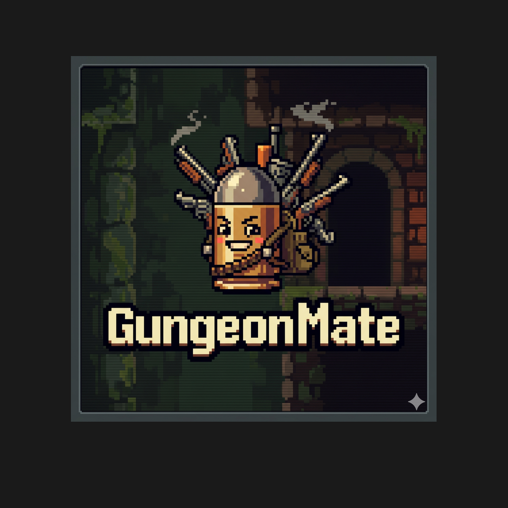

# 🌌 Gungeon Mate

<p align="center">
  
</p>

<p align="center">
  <b>The ultimate high-performance offline companion app for Enter the Gungeon.</b><br>
  Track runs, master guns & items, activate local co-op, and conquer the Gungeon — 100% free and open-source.
</p>

<p align="center">
  
  
  
</p>

---

## 🎯 The Road to v1.0.0 (Launching July 2026!)
Gungeon Mate is gearing up for its official **v1.0.0 release on the Google Play Store in July 2026**. Version **v0.9.1** is our major pre-release milestone, completely free for all fans to download, test, and enjoy.

👉 **Download the Release APK:** You can grab the production-ready APK directly from the [latest release](https://github.com/Thothius/GungeonMate/releases) (or sideload `gungeon-mate-v0.9.1.apk` from the local `builds/` directory).

---

## ⚔️ Gungeoneer Roster Support
Fully integrates with the starting conditions, health, and custom mechanics of the main characters:

<p align="center">
   &nbsp; &nbsp; &nbsp; &nbsp;
   &nbsp; &nbsp; &nbsp; &nbsp;
   &nbsp; &nbsp; &nbsp; &nbsp;
  
</p>

- **The Hunter:** Detailed Huntress Crossbow Damage Breakpoint HUD & companion dog dig probability metrics.
- **The Robot:** Automatic damage-scaling calculations based on the custom Junk Counter.
- **The Bullet & Others:** Starter weapon profiles and special passive traits pre-mapped.

---

## ⚡ Main Features

### 🎮 Dynamic Run Tracking
Pick your character to auto-load stats, starting loadouts, and passive items. Track your active inventory on a beautiful, auto-scaling grid that scales smoothly from 3 to 20+ items.

### ✨ Live Coolness & Curse Telemetry
Never guess your status again. The app automatically calculates active Coolness (cooldown reduction, chest reward rates) and Curse (jammed enemies, mimic rates) based on your real-time items, with manual shrine tuning support.

### 🌌 4 Responsive Grid Layouts
Swap instantly in settings between:
- **Classic Periodic:** Standard periodic table layout with icons and small name cards.
- **Tactical Stats:** Dense split-panel layout with real-time gun/item telemetry.
- **High-Def Gallery:** Double-column showcase cards displaying massive pixel art details.
- **RPG Bag:** Horizontal card rows displaying titles, detailed category tags, and stats.

### 🔮 Real-Time Stylization & Customizer
Unlock the Style Lab! Toggle between 12 handmade interactive particle emitters with real-time accelerometer tilt-physics, select trippy animated backdrops, and choose from 66 Google Fonts grouped by artistic genres.

### 🔗 Event-Driven Local Co-op Sync
Connect with Player 2 (Sidekick) over local Bluetooth or Wi-Fi Direct using Google Nearby Connections. Instantly synchronize inventories, transfer run summaries, or swap full states.

### 🐞 Integrated Bug Reporting & Context
We've integrated a robust, contextual **Send Bug/Feedback** button inside core menus:
- In the **Run Dashboard (Inventory)** header.
- On **every Gun and Item Detailed View** (pre-filling the gun/item name).
- Inside the **Multiplayer Diagnostics / Reconnect** panel.
- Easily launches standard mail clients preconfigured to send reports to `gungeonmate@gmail.com` with full telemetry.

---

## 🛠️ Build and Run

To run or compile this project locally:

### Prerequisites
- [Flutter SDK](https://docs.flutter.dev/get-started/install) (Dart SDK ^3.7.0)

### 1. Fetch Dependencies
```bash
flutter pub get
```

### 2. Run in Debug Mode
```bash
flutter run
```

### 3. Build Production Release APK
```bash
flutter build apk --release
```

---

<p align="center">
  <i>Made with 💜 for the Gungeon community. Gungeon Mate is unofficial fan content.</i><br>
  <b>v0.9.1 — Road to July Launch!</b>
</p>
