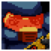

# Gungeon Mate

<p align="center">
  
</p>

<p align="center">
  <b>The ultimate high-performance offline companion app for Enter the Gungeon.</b><br>
  Track runs, master guns & items, activate local co-op, and conquer the Gungeon — 100% free and open-source.
</p>

<p align="center">
  
  
  
</p>

---

## 📥 Sideload Release Build

<p align="center">
  <a href="https://github.com/Thothius/GungeonMate/raw/master/builds/gungeon-mate-v0.9.1.apk">
    
  </a>
</p>

*Grab the production-ready build above to sideload directly onto any Android device! Play Store version is incoming, with our grand v1.0.0 launch slated for July 2026!*

---

## 🎯 The Gungeoneer's Mission

May your blanks be plentiful, your ammo crates full, and your pasts successfully slain! Built entirely out of pure love for Dodge Roll's legendary masterpiece, **Gungeon Mate** is the ultimate second-screen companion for every gungeoneer braving the dark, shifting chambers of the Gungeon. 

Whether you are a seasoned Gungeon Master running double-digit Curse loads or a fresh marine struggling on Chamber 1, this app is crafted to aid you in mastering every shell, gun, and synergy.

---

## ⚔️ Gungeoneer Roster Support
Fully integrates with the starting conditions, health, and custom mechanics of the main characters:

<p align="center">
   &nbsp; &nbsp; &nbsp; &nbsp;
   &nbsp; &nbsp; &nbsp; &nbsp;
   &nbsp; &nbsp; &nbsp; &nbsp;
  
</p>

*  &nbsp; **The Hunter:** Detailed Huntress Crossbow Damage Breakpoint HUD & companion dog dig probability metrics.
*  &nbsp; **The Robot:** Automatic damage-scaling calculations based on your custom Junk Counter.
*  &nbsp; **The Bullet & Others:** Starter weapon profiles and special passive traits pre-mapped.

---

## ⚡ Main Features

*  &nbsp; **Dynamic Run Tracking:** Pick your character to auto-load stats, starting loadouts, and passive items. Track your active inventory on a beautiful, auto-scaling grid that scales smoothly from 3 to 20+ items.
*  &nbsp; **Live Coolness & Curse Telemetry:** Never guess your status again. The app automatically calculates active Coolness (cooldown reduction, chest reward rates) and Curse (jammed enemies, mimic rates) based on your real-time items, with manual shrine tuning support.
*  &nbsp; **4 Responsive Grid Layouts:** Swap instantly in settings between *Classic Periodic* (compact table layout), *Tactical Stats* (dense split-panel layout with real-time gun/item telemetry), *High-Def Gallery* (massive pixel-art showcase), or *RPG Bag* (rows with detailed inline descriptions and category tags).
*  &nbsp; **Real-Time Stylization & Customizer:** Unlock the Style Lab! Toggle between 12 handmade interactive particle emitters with real-time accelerometer tilt-physics, select trippy animated backdrops, and choose from 66 Google Fonts grouped by artistic genres.
*  &nbsp; **Integrated Bug Reporting & Context:** We've integrated a robust, contextual **Send Bug/Feedback** button inside core menus (Run Dashboard header, every Gun/Item detail page, and Multiplayer diagnostics). Easily launches standard mail clients preconfigured to send reports to `gungeonmate@gmail.com` with full telemetry.

---

## 🔗 How Local Co-op Works (Layman's Guide)

Gungeon Mate uses **Google Nearby Connections** (a secure, high-speed Bluetooth + Wi-Fi Direct protocol) to link two devices together. **No servers, no logins, zero internet lag, and 100% offline-friendly!**

### 🗺️ The Connection Blueprint

```
 📱 Player 1 (Main Host)               📱 Player 2 (Sidekick Cultist)
┌─────────────────────────┐           ┌─────────────────────────┐
│ Generates Session PIN   │           │ Enters PIN & Scans      │
│     e.g., [ 5291 ]      │ ──[PIN]──>│                         │
└────────────┬────────────┘           └────────────┬────────────┘
             │                                     │
             ▼                                     ▼
     [ Bluetooth Beacon ] <────────────────> [ Local Search ]
             │                                     │
             └───────────[ Secure Handshake ]──────┘
                                 │
                                 ▼
                     ⚡ INVENTORIES SYNCHRONIZED ⚡
```

### 📋 Visualized Connection Steps:

1. **👤 The Host Starts:** Player 1 taps "Local Run" on the home screen, chooses their character, and selects **Main Role** in the multiplayer settings. This generates a **4-digit Session PIN** (displayed in the link panel).
2. **👥 The Cultist Joins:** Player 2 opens Gungeon Mate on their phone, selects **Sidekick Role**, and enters the 4-digit PIN.
3. **🤝 The Handshake:** Player 2's device starts a targeted local scan. It filters out all other devices and connects directly to Player 1's device. Both players tap "Approve" on the handshake popup.
4. **⚡ Zero-Lag Loading & Sync:** The loading completes in milliseconds! Once connected, any item or gun added or removed by either player updates **both screens in real-time**! You can even view each other's live stats, aggregate DPS, and transfer items back and forth!

---

## 🛠️ Build and Run

To run or compile this project locally:

### Prerequisites
- [Flutter SDK](https://docs.flutter.dev/get-started/install) (Dart SDK ^3.7.0)

### 1. Fetch Dependencies
```bash
flutter pub get
```

### 2. Run in Debug Mode
```bash
flutter run
```

### 3. Build Production Release APK
```bash
flutter build apk --release
```

---

## 🔮 Disclaimer

*Gungeon Mate is an unofficial, completely free fan-made companion app built out of pure love and dedication for the Gungeon community. All rights to "Enter the Gungeon" belong to Dodge Roll and Devolver Digital. All item stats, descriptions, and synergy data are sourced from the official Enter the Gungeon Wiki at [wiki.gg](https://enterthegungeon.wiki.gg).*

<p align="center">
  <i>Made with 💜 for the Gungeon community. Gungeon Mate is free forever.</i><br>
  <b>v0.9.1 — Road to July Launch!</b>
</p>
